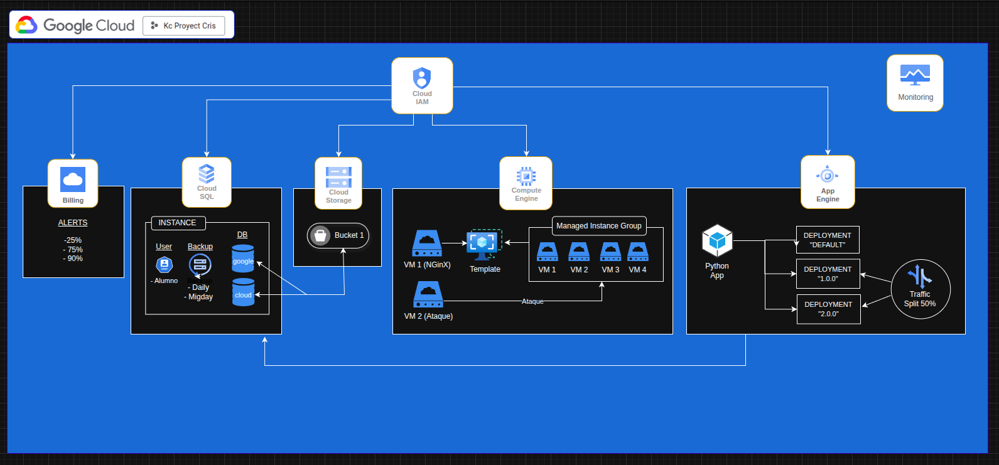

# GCP Infrastructure Project 

Proyecto práctico completo sobre migración a la nube de Google Cloud Platform

## Arquitectura



Arquitectura unificada diseñada con Draw.io que muestra todos los servicios desplegados y sus relaciones.

---

## Qué hace este proyecto

El objetivo fue aprender a trabajar con los principales servicios de GCP construyendo una solución real de principio a fin. El proyecto se divide en cuatro partes:

### Parte 1 — Proyecto y facturación
- Creación del proyecto en GCP con cuenta personal
- Configuración de alertas de facturación en tres umbrales: 25%, 75% y 90%
- Diseño de la arquitectura final unificada (ver imagen superior)

### Parte 2 — Base de datos con Cloud SQL
- Despliegue de base de datos MySQL mediante Cloud SQL
- Copias de seguridad automáticas configuradas al mediodía
- Creación de usuario `alumno` y dos bases de datos: `google` y `cloud`
- Exportación de las bases de datos en formato SQL a un bucket de Cloud Storage
- Importación del fichero y verificación mediante logs de auditoría
- Escalado de la máquina a la configuración mínima de CPU y RAM

### Parte 3 — Autoescalado con Compute Engine
- Creación de imagen personalizada con servidor web Nginx instalado
- Plantilla de instancia basada en esa imagen con configuración mínima
- Grupo de instancias con autoescalado (mínimo 1, máximo 4 VMs) basado en consumo de CPU
- VM independiente con script para simular carga y verificar el autoescalado

### Parte 4 — Despliegue en App Engine
- Deploy de aplicación Python en App Engine Standard adaptando el `app.yaml` a Python 3
- Conexión de la app con la base de datos Cloud SQL configurada en la Parte 2
- Segundo deploy sobre servicio `practica` con versión `version-1-0-0`
- Tercer deploy con versión `version-2-0-0`
- Configuración de Traffic Split al 50% aleatorio entre las dos versiones

### Bonus — Infraestructura como código con Terraform
- Configuración completa en `main.tf` usando el proveedor oficial de Google Cloud
- Cuenta de servicio con credenciales JSON
- Recursos desplegados:

| Recurso | Nombre | Descripción |
|---|---|---|
| `google_compute_network` | `red-terraform` | Red VPC con subredes automáticas |
| `google_storage_bucket` | `terraform-sigma-chemist` | Bucket de almacenamiento en región EU |
| `google_compute_instance` | `vm-terraform` | VM Debian 11 (e2-micro) en europe-west1 |

---

## Tecnologías utilizadas

- **Google Cloud Platform**: Cloud SQL, Compute Engine, Cloud Storage, App Engine, Cloud IAM, Cloud Monitoring
- **Terraform** ~> 5.0 — Infraestructura como código
- **Nginx** — Servidor web en imagen personalizada
- **Python 3** — Aplicación desplegada en App Engine
- **Draw.io** — Diseño de arquitectura

---

## Requisitos para ejecutar el Terraform

- Terraform instalado (`>= 1.0`)
- Cuenta de GCP con proyecto activo
- Credenciales de cuenta de servicio en formato JSON

```bash
# Inicializar Terraform
terraform init

# Ver los cambios antes de aplicar
terraform plan

# Desplegar la infraestructura
terraform apply

# Destruir la infraestructura
terraform destroy
```

> ⚠️ El fichero de credenciales JSON no está incluido en el repositorio por seguridad. Genera el tuyo propio desde la consola de GCP.

---

## Aprendizajes

A través de este proyecto he trabajado con:

- Diseño de arquitecturas cloud reales con múltiples servicios interconectados
- Gestión de bases de datos en cloud con backups automáticos y auditoría
- Alta disponibilidad y autoescalado con Managed Instance Groups
- Despliegue y versionado de aplicaciones con traffic splitting en App Engine
- Infraestructura como código (IaC) con Terraform
- Control de accesos con Cloud IAM y monitorización con Cloud Monitoring

---

*Proyecto desarrollado durante el Bootcamp DevOps & Cloud Engineering — 2025/2026*
